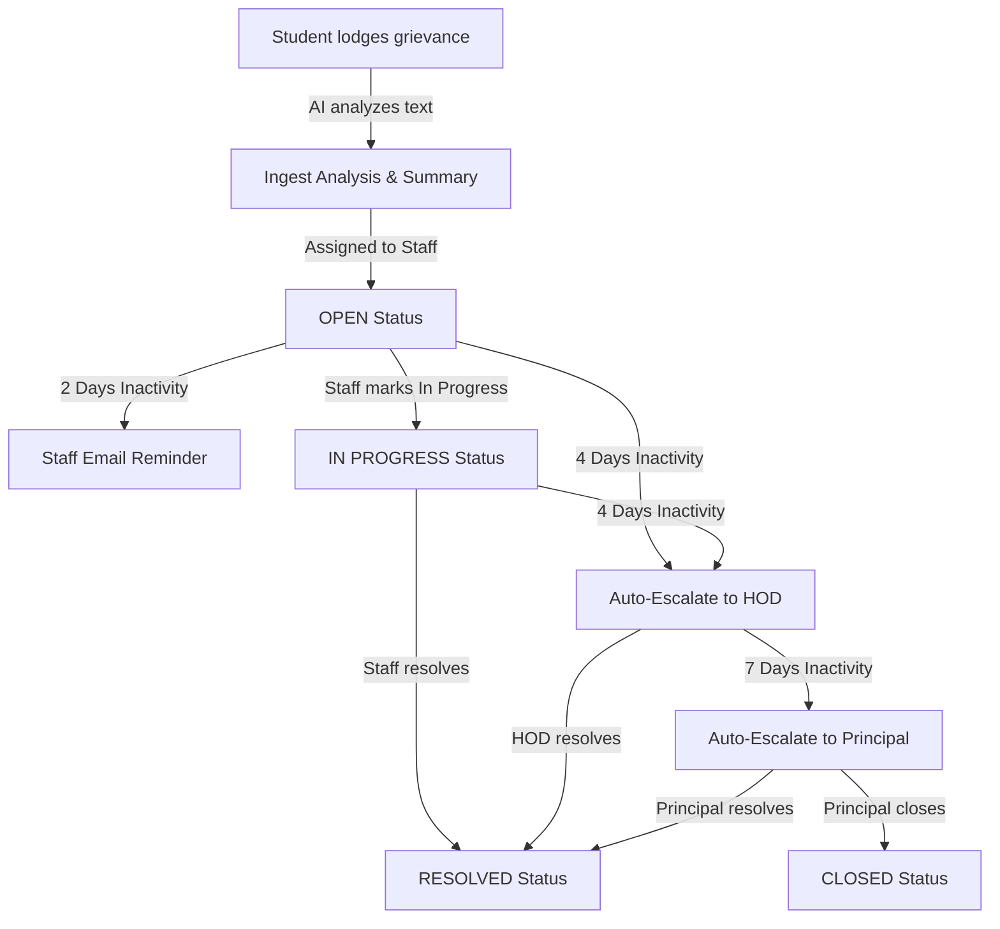

# 🛡️ Grievances Connect (MERN Stack + Gemini AI)

**Grievances Connect** is a premium, fully-functional, role-based College Grievance Redressal and Management System. Built on the **MERN (MongoDB, Express, React, Node.js) Stack**, the application features a **Google Gemini AI Copilot** to provide smart auto-summarization, sentiment analysis, priority classification, and automated resolution drafting. 

The system guarantees administrative accountability through a background **Auto-Escalation SLA Engine** that automatically sends reminders and escalates inactive grievances level-by-level (Staff ➔ HOD ➔ Principal) according to predefined timeline milestones.

---

## 🛠️ Architecture & Grievance Lifecycle

The grievance lifecycle is designed to ensure accountability. Below is the workflow diagram:



---

## 🌟 Key Capabilities Implemented

### 1. ✨ Google Gemini AI Copilot
* **AI Ingest Analysis**: On grievance submission, Google's `gemini-2.0-flash` model analyzes the description to:
  * Generate a **1-sentence Executive Summary** for handler dashboards.
  * Extract the student's emotional **sentiment** (e.g., *ANXIOUS*, *FRUSTRATED*, *CONCERNED*).
  * Automatically suggest the **Urgency Priority** (`LOW`, `MEDIUM`, `HIGH`).
* **AI Resolution Drafter**: Provides staff, HOD, and principal users with a **"✨ AI Assistant: Draft Resolution Reply"** tool inside discussion feeds, instantly drafting polite, policy-aligned response templates based on the ticket description.

### 2. Role-Based Portals
* 🎓 **Student Portal**: Lodge grievances, upload attachments, track timelines, chat with support, and file anonymously.
* 🧑‍🏫 **Staff Portal**: Update ticket status to **In Progress**, run the AI draft reply generator, **Resolve** complaints, or **Escalate** to the HOD.
* 🏢 **HOD Portal**: Oversee department-level grievances, participate in discussions, and resolve or escalate tickets.
* 👑 **Principal Portal**: College-wide operational visibility. Actions include **Resolve** or **Close** ticket.
* ⚙️ **Admin Portal**: Provision users/departments and access the system ledger. Includes the **Admin Analytics Center** featuring visual performance charts.

### 3. Auto-Escalation Engine
* **2 Days**: Triggers transactional email and dashboard reminders to the assigned Staff.
* **4 Days**: Changes status to `ESCALATED_TO_HOD`, notifying the student and HOD.
* **7 Days**: Changes status to `ESCALATED_TO_PRINCIPAL`, notifying the student, HOD, and Principal.
* **Test Mode**: Booting the server with `ESCALATION_TEST_MODE=true` shifts the days to **minutes** (2 mins, 4 mins, 7 mins) for rapid live demonstrations.

### 4. Direct Discussion Feed / Conversations
* Direct chat threads inside any ticket between students and support staff, supported by real-time notification alerts.

---

## 🚀 Manual Run Instructions

### Prerequisites
* **Node.js** (v18+)
* **MongoDB** active on port `27017` with connection string `mongodb://localhost:27017/`
* **Google Gemini API Key** (from Google AI Studio)

### 1. Node.js Express Backend
1. Navigate to:
   ```bash
   cd backend
   ```
2. Create `backend/.env` containing:
   ```env
   PORT=8080
   MONGO_URI=mongodb://localhost:27017/grievance_connect
   JWT_SECRET=your_jwt_secret_here
   SMTP_HOST=smtp.gmail.com
   SMTP_PORT=587
   SMTP_USER=your_gmail@gmail.com
   SMTP_PASS=your_app_password
   ESCALATION_TEST_MODE=false
   GEMINI_API_KEY=your_gemini_api_key
   ```
3. Install packages:
   ```bash
   npm install
   ```
4. Start the application:
   ```bash
   npm start
   ```
   * *Note*: On first boot, roles, departments, and the default admin user will be seeded automatically.

### 2. React Frontend
1. Navigate to:
   ```bash
   cd Frontend
   ```
2. Run development server:
   ```bash
   npm run dev
   ```
3. Open **`http://localhost:3000`** in your browser.

---

## 🧪 Default Accounts
* **Admin Login**:
  * **Email**: `admin@college.com`
  * **Password**: `admin123`
* Create other test profiles (Student, Staff, HOD, Principal) using the **Create User** form on the Admin Dashboard to test the full lifecycle.
