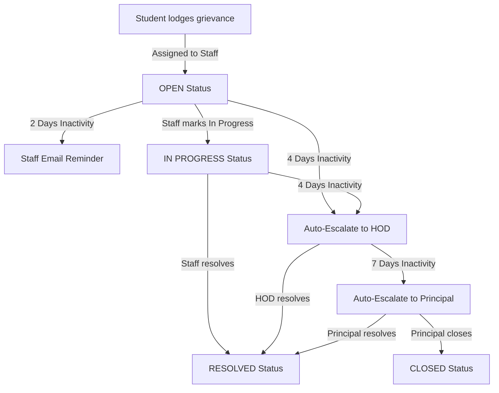

# 🛡️ Grievances Connect

**Grievances Connect** is a premium, fully-functional, role-based College Grievance Redressal and Management System. It allows Students to lodge grievances, track their progress, communicate directly with handlers, and automatically escalates unresolved complaints based on timeline SLA requirements.

The application features a modern React + Vite frontend connected to a robust Spring Boot backend with PostgreSQL.

---

## 🛠️ Architecture & Grievance Lifecycle

The lifecycle of a grievance is designed to ensure accountability. Below is the workflow diagram:



---

## 🌟 Key Capabilities Implemented

### 1. Role-Based Portals
* 🎓 **Student Portal**: Lodge grievances with titles, descriptions, categories, priority, file attachments, and option to submit anonymously. Includes a notification panel, timeline history tracking, and direct discussion threads.
* 🧑‍🏫 **Staff Portal**: View assigned complaints, update status to **In Progress**, post discussion remarks, **Resolve** them, or **Escalate** to the departmental HOD.
* 🏢 **HOD Portal**: Oversee departmental grievances, **Resolve** escalated complaints, or **Escalate** to the Principal.
* 👑 **Principal Portal**: College-wide view of escalated grievances. Actions include **Resolve** or **Close** ticket.
* ⚙️ **Admin Portal**: Manage system users, provision roles and departments, and access the system ledger. Includes the **Admin Analytics Center** featuring visual performance charts.

### 2. Spring-Scheduled Auto-Escalation
* **2 Days**: Sends an email + in-app reminder to the assigned Staff member.
* **4 Days**: Automatically changes status to `ESCALATED_TO_HOD`, alerts the departmental HOD (email + in-app), and notifies the student.
* **7 Days**: Automatically changes status to `ESCALATED_TO_PRINCIPAL`, alerts the Principal, and creates notifications.
* **Test Mode**: Booting the server with `-Descalation.test.mode=true` shifts the days to **minutes** (2 mins, 4 mins, 7 mins) for rapid live demonstrations.

### 3. Discussion Feed / Conversations
* Students and support staff can interact directly inside any ticket via a clean **Discussion Feed** chat tab. Comments trigger real-time in-app dashboard alerts.

### 4. Advanced Filtering & Urgency Tags
* Urgency priorities (`LOW`, `MEDIUM`, `HIGH`) help organize tickets.
* Multi-select filters allow sorting and filtering by **Status**, **Category**, **Priority**, **Department**, and **Anonymous status**.

### 5. Analytics Dashboard
* Rendered dynamically using Vanilla CSS and custom SVG elements:
  * Horizontal progress indicators for department-wise complaints.
  * Vertical monthly inflows bar graphs.
  * Overall college resolution success gauge.
  * System average response time tracker.

---

## 🚀 Manual Run Instructions

### Prerequisites
* Node.js installed
* MongoDB installed and active on port `27017` with connection string `mongodb://localhost:27017/`.

### 1. Node.js Express Backend
1. Open a terminal and navigate to:
   ```bash
   cd backend
   ```
2. Install dependencies:
   ```bash
   npm install
   ```
3. Start the application:
   ```bash
   npm start
   ```
   * **Note**: On first startup, the database `grievance_connect` will be created, and the default roles, departments, and admin user will be seeded automatically.
   * **Auto-Escalation Test Mode**: To run with escalations in minutes rather than days, edit `backend/.env` and set `ESCALATION_TEST_MODE=true` before running.

### 2. React Frontend
1. Open a second terminal window and navigate to:
   ```bash
   cd Frontend
   ```
2. Run development server:
   ```bash
   npm run dev
   ```
3. Open **`http://localhost:3000`** in your browser.

---

## 🧪 Testing and Verification

### 1. Default Accounts
* **Admin Login**:
  * **Email**: `admin@college.com`
  * **Password**: `admin123`
* Use the **Create User** form on the Admin Dashboard to create student, staff, HOD, and principal accounts bound to specific departments to test the full lifecycle.

### 2. Testing and Verification
Verify that the Express server starts, connects to MongoDB, and serves endpoints on port `8080`. You can perform manual verification using the default admin credentials, lodging complaints, and checking auto-escalations on the UI.
